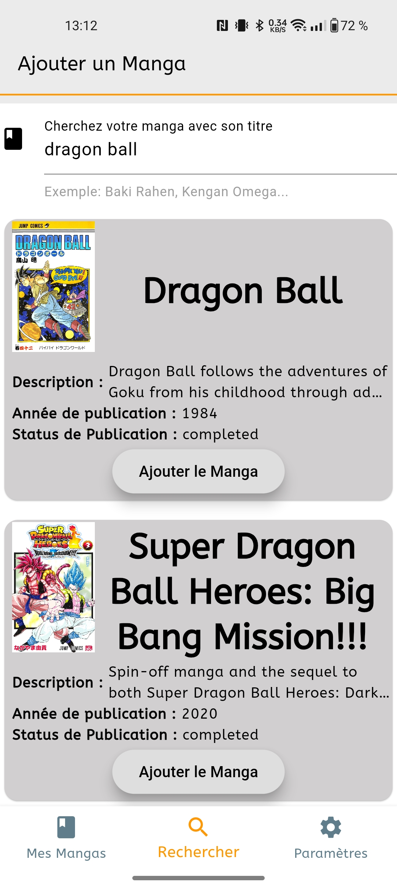
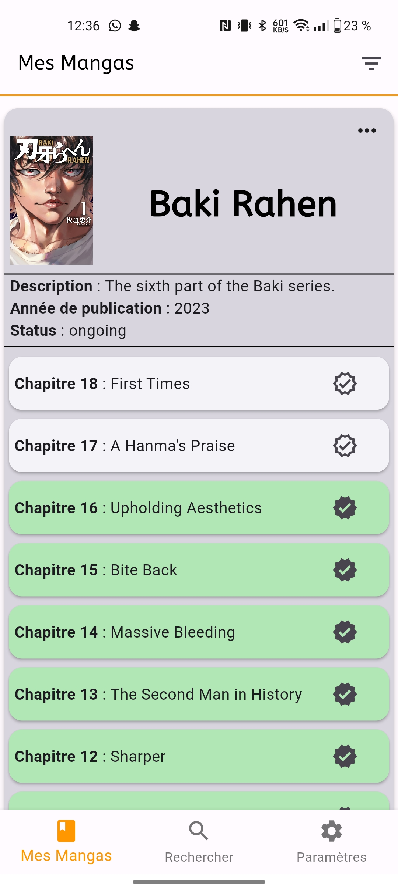

# miro_manga_chapter_update

Flutter App qui permet de savoir lorsque les derniers chapitres d'un manga qu'un utilisateur lit sont sortis grâce à l'API Mangadex. La source de données de Mangadex étant mise à jour par des bénévoles, certains chapitres de mangas n'apparaissent pas encore.

Flutter App Allowing you to know when the latest chapters of a manga the user is reading are released thanks to Mangadex's API. Due to Mangadex's datasource being updated by volunteers, some manga chapters might not appear yet, hence you might not see them in your manga chapters' lists.

## Trello RoadMap

https://trello.com/b/lBzxEwDj/mmcu

## Figma Design Prototype

https://www.figma.com/file/8DnvxLRgf2KhH0NIbvgKow/MMCU-UI-Prototype%2FGuide?type=design&mode=dev&t=XdYJtt2RjQrOMwpS-1

## Application screeshots

Voici quelques captures d'écran pour vous donner une idée de ce à quoi l'application ressemble. 
Here are a couple screenshots to give you an idea of how the application looks like. 

- Recherche et d'ajout de nouveaux mangas à l'application/Search and add new mangas to the app:

Cette page permet de chercher via un champs de texte des mangas par leur titre. Si il y'a plusieurs correspondances, une liste contenant les informations des mangas qui matchent la requête de l'utilisateur sont affichés. L'utilisateur peut ensuite ajouter le manga qu'il souhaite dans l'application via le bouton ajouter le manga. 

This page allows the user to look for a manga with its title. If there are multiple matches, cards displaying the manga info are displayed as a list. The user can then choose the manga he wants and add it to the app with the button Add the manga. 

- Ma bibliothèque de mangas/My Manga Library:

Dans votre mangathèque se trouvent tous les mangas sauvegardés par l'utilisateur dans l'application avec leurs informations (description, année de publication, status de publication) et les 10 chaptires les plus récents au moment de la sauvegarde.  

Here are all the mangas you saved in the app with their informations (description, year of publication, publication status), and the 10 latests chapters
of the mangas at the time you saved it in the app. The chapters in green are the chapters you indicated as read.

