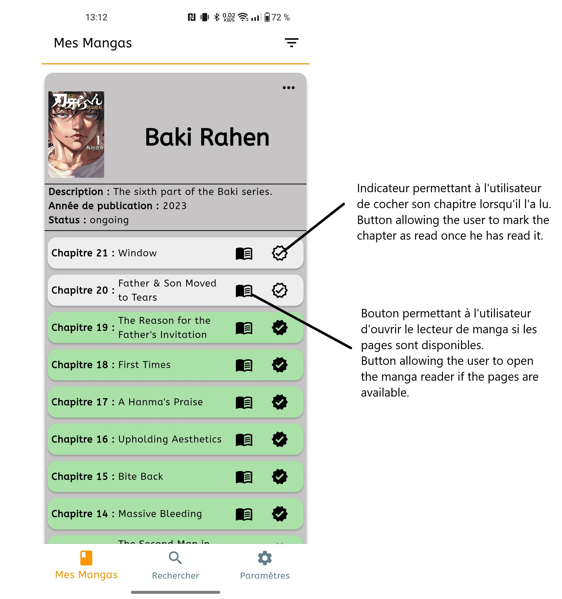

# miro_manga_chapter_update

Flutter App qui permet de savoir lorsque les derniers chapitres d'un manga qu'un utilisateur lit sont sortis grâce à l'API Mangadex. La source de données de Mangadex étant mise à jour par des bénévoles, certains chapitres de mangas n'apparaissent pas encore.

Flutter App Allowing you to know when the latest chapters of a manga the user is reading are released thanks to Mangadex's API. Due to Mangadex's datasource being updated by volunteers, some manga chapters might not appear yet, hence you might not see them in your manga chapters' lists.

## Trello RoadMap

https://trello.com/b/lBzxEwDj/mmcu

## Figma Design Prototype

https://www.figma.com/file/8DnvxLRgf2KhH0NIbvgKow/MMCU-UI-Prototype%2FGuide?type=design&mode=dev&t=XdYJtt2RjQrOMwpS-1

## Application screeshots

<ins>**FR**</ins>: Voici quelques captures d'écran pour vous donner une idée de ce à quoi l'application ressemble. 
<ins>**EN**</ins>: Here are a couple screenshots to give you an idea of how the application looks like. 

- Recherche et d'ajout de nouveaux mangas à l'application/Search and add new mangas to the app:

<ins>**FR**</ins>: Cette page permet de chercher via un champs de texte des mangas par leur titre. Si il y'a plusieurs correspondances, une liste contenant les informations des mangas qui matchent la requête de l'utilisateur sont affichés. L'utilisateur peut ensuite ajouter le manga qu'il souhaite dans l'application via le bouton ajouter le manga. 

<ins>**EN**</ins>: This page allows the user to look for a manga with its title. If there are multiple matches, cards displaying the manga info are displayed as a list. The user can then choose the manga he wants and add it to the app with the button Add the manga. 

- Ma bibliothèque de mangas/My Manga Library:

<ins>**FR**</ins>: Dans votre mangathèque se trouvent tous les mangas sauvegardés par l'utilisateur dans l'application avec leurs informations (description, année de publication, status de publication) et les 10 chaptires les plus récents au moment de la sauvegarde. Depuis cette page l'utilisateur peut ouvrir le lecteur de manga qui permet de lire chaque chapitre disponible sur le site Mangadex.org dans l'application, et aussi cocher ce chapitre pour indiquer qu'il est lu ou non (couleur verte = lu)  

<ins>**EN**</ins>:Here are all the mangas you saved in the app with their informations (description, year of publication, publication status), and the 10 latests chapters
of the mangas at the time you saved it in the app. The chapters in green are the chapters you indicated as read. On this page the user is able to open the manga reader allowing him to read any available chapters on Mangadex.org, and also check this chapter to indicate it has been read (green color = read)

- Notification de publication de nouveaux chapitres/New chapters publication update : 

<ins>**FR**</ins>: L'application possède une fonctionnalité qui toutes les 6 heures va exécuter du code en fond qui va notifier l'utilisateur lorsqu'un chapitre des mangas qu'il a sauvegardé possède un nouveau chapitre (lorsqu'un chapitre avec un numéro plus grand que le dernier sauvegardé dans la BDD utilisateur est disponible sur Mangadex.org). L'application va notifier l'utilisateur qu'un chapitre du manga (intitulé dans l'exemple Juujika No Rokunin) possède un nouveau chapitre : ici le 168.
Cette notification possède deux boutons d'actions : une qui permet d'ouvrir directement le lecteur de manga, et l'autre de cocher le chapitre depuis la notification.

<ins>**EN**</ins>: The application has a feature which will every 6 hours execute code in the background of the device which will notify the user if a chapter more recent than latest saved in his device is available on Mangadex.org. In this case a chapter of the manga Juujika No Rokunin wass saved in the DB of the device : the chapter 168. This notification has two action buttons : one which allows the user to directly open the manga reader from the notification, and the other to check the chapter from the notification.

